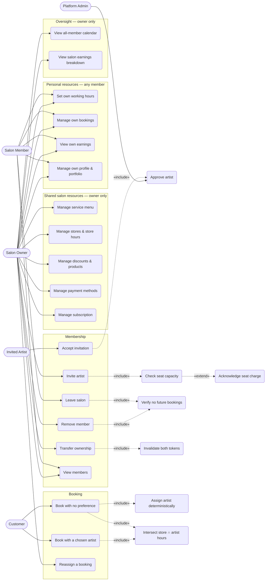

# B-Edge — Multi-Artist Salon Support
## Business Requirements Document · v1

**Date:** 2026-09-21 · **Status:** Draft for approval · **Author:** Engineering
**Trigger:** Rania operates a salon and intends to onboard other makeup artists into it.
**Rule of this document:** every statement about the current system was verified against
the schema and the source on 2026-09-21. Anything not found in code is labelled
**`UNIMPLEMENTED`** rather than assumed to work.

---

## 1. Why this exists

B-Edge was designed for a salon and built for a soloist.

The database has been salon-shaped since migration 001 — ten tables carry `salon_id`, and
`artists.salon_id` is nullable precisely so an artist can be attached to one. But every
salon on the platform today has exactly one artist in it, and no line of application code
has ever had to answer the question *"which member of this salon is asking?"*

That question arrives the moment Rania invites a second artist. This document states what
the business needs before any of it is built.

**Verified data reality (2026-09-21):** 5 salons · each with exactly 1 artist · all named
`"<name> Studio"` by the onboarding auto-naming · 1 orphan artist with `salon_id IS NULL`.

---

## 2. Verified starting state

### 2.1 What already exists and works

| Capability | Evidence |
|---|---|
| Salons are a first-class table | `salons(id, owner_id, name, name_ar, subscription_plan, plan_expires_at, is_active, …)` |
| An artist can be attached to a salon | `artists.salon_id` — **nullable**, FK to `salons` |
| Ten tables are already salon-scoped | `artists, audit_events, bookings, client_notes, discounts, orders, products, salon_payment_methods, services, stores` |
| Salon identity travels in the token | `jwt.Claims{UserID, SalonID *uuid.UUID, Role string}` |
| Handlers already scope writes by salon | `SalonIDFromContext(c)` → `CreateService(ctx, salonID, req)` |
| Seat-based pricing exists in the catalogue | `plans.seat_price`, `plans.included_seats` — populated for all 6 plans |
| Per-artist override of a store setting has a precedent | `artist_store_buffers(artist_id, from_store_id, to_store_id, weekday_buffer_min, weekend_buffer_min)` |

**This is the single most important finding: the data model does not need re-architecting.**
The work is application-layer.

### 2.2 What does not exist — the six gaps

| # | Gap | Evidence | Severity |
|---|---|---|---|
| **G1** | **No authorisation boundary inside a salon.** `salons.owner_id` is never consulted for any authorisation decision anywhere in the codebase (grep-verified). Every artist holding a `salon_id` claim can write every salon-scoped row. | `internal/*/handler.go` — `SalonIDFromContext` only | **Critical** |
| **G2** | **No way to join a salon.** The only `INSERT INTO salons` in the codebase is `internal/onboarding/repository.go:63`, inside a transaction that creates salon → artist → store together. A salon is created *by* its first artist and can never gain a second. | `onboarding/repository.go:63` | **Critical** |
| **G3** | **No per-artist working hours.** `business_hours` and `business_hours_exceptions` are keyed on `store_id`. Two artists at one store are forced to share one schedule. `artist_stores` is `(artist_id, store_id)` only — a membership link with no schedule. | schema | **Critical** |
| **G4** | **Billing is per artist, and seats are dead.** `subscriptions.artist_id`. Invoice amount is `Amount: sub.MonthlyPrice` — flat. `seat_price`/`included_seats` are read, written and CRUD-plumbed through `internal/billing` and **never enter any calculation**. A 5-artist salon pays 5 separate subscriptions. | `billing/service.go:363` | **High** |
| **G5** | **Money lands in one place, credit is computed in another.** `salon_payment_methods` is salon-scoped with **no `artist_id`** — one OMT/Whish account per salon. `internal/earnings` filters `WHERE artist_id = $1`. A member's deposits arrive in the owner's account while the member is credited on paper. | `earnings/repository.go:69,109,146` | **High** |
| **G6** | **No customer-facing notion of choosing an artist within a salon.** Discovery surfaces artists, not salons. | `internal/discovery` | Medium |

> **G3 was not in the original four-gap analysis.** It surfaced while verifying the schema
> for this document and is arguably larger than G1: without it, a salon cannot express that
> Rania works Tue–Sat and a new hire works evenings, which is the ordinary case.

---

## 3. Actors

| Actor | Definition | Exists today? |
|---|---|---|
| **Salon Owner** | The artist in `salons.owner_id`. Accountable for the salon's menu, stores, hours, money and membership. | Row exists; **no behaviour attached** |
| **Salon Member** | An artist with `artists.salon_id = X` who is not the owner. Delivers services, manages their own diary. | `UNIMPLEMENTED` — cannot be created |
| **Solo Artist** | An artist who is the owner of a salon containing only themselves. **Every artist on the platform today.** | Yes — the only live case |
| **Customer** | Books a service, with or without choosing a specific artist. | Yes |
| **Platform Admin** | Approves artists (`artists.status: pending → active`), manages plans. | Yes — `admin/service.go:58` |

**Design constraint:** a Solo Artist is not a separate mode. A soloist is an owner of a
one-member salon, and *must never see an interface that mentions members, seats or
invitations*. B-Edge's launch artist is a soloist; multi-artist support that degrades the
solo experience is a net loss.

---

## 4. Scope

### In scope

1. Salon membership — invite, accept, list, remove, transfer ownership
2. An owner/member authorisation boundary over every salon-scoped resource
3. Per-artist working hours, intersected with store hours
4. Seat-based billing at the salon grain
5. Earnings and settlement visibility split by role
6. Customer-facing artist selection within a salon

### Out of scope

- **Payouts, splits, commission processing.** B-Edge holds no money. OMT and Whish are
  out-of-band. This does not change.
- **An artist belonging to more than one salon** (see D-MS2).
- **Non-artist staff roles** — receptionist, manager, assistant (see D-MS10).
- **Per-artist pricing overrides** of the salon menu (see D-MS9).
- **Commission/rent agreements between owner and member.** B-Edge reports who earned what;
  the parties settle privately.

---

## 5. Business rules

| ID | Rule | Rationale |
|---|---|---|
| **BR-1** | An artist belongs to **at most one** salon. | `artists.salon_id` is a single column. A join table is the migration path, not v1. |
| **BR-2** | A salon has **exactly one** owner, who **must** be an active member of that salon. | Prevents an absentee owner locking out the people doing the work. |
| **BR-3** | The last remaining member of a salon **cannot leave**. Ownership must transfer first, or the salon is closed. | Avoids orphaned salons owning live stores, services and bookings. |
| **BR-4** | Removing a member **never deletes** their bookings, reviews, earnings history or client notes. | Financial and reputational history is a record, not a preference. |
| **BR-5** | A member **cannot be removed while they hold future confirmed bookings.** Those must be reassigned or cancelled first. | A customer must never discover their appointment evaporated. |
| **BR-6** | An artist's `handle`, profile, portfolio, reviews and rating **belong to the artist**, not the salon, and travel with them on departure. | `artists.handle` is the public identity behind `/book/rania`. |
| **BR-7** | A salon invitation **does not bypass platform approval.** An invited artist still enters `status='pending'` and requires admin approval. | The approval gate is a quality control, not an onboarding step. |
| **BR-8** | Shared salon resources are **owner-write, member-read**: services, stores, store hours, discounts, products, payment methods, billing. | G1. This is the boundary that does not exist today. |
| **BR-9** | Personal resources are **member-write**: own working hours, own bookings, own client notes, own portfolio, own profile. | A member must be able to run their own day. |
| **BR-10** | An artist's bookable availability is `store_hours ∩ artist_schedule`, minus their own bookings and buffers. | G3. Defaults to "all store hours" so soloists see no change. |
| **BR-11** | A member sees **only their own** earnings. The owner sees **every member's** earnings and the salon aggregate. | Commercially standard; also the least surprising default. |
| **BR-12** | One subscription per **salon**, priced `monthly_price + max(0, active_members − included_seats) × seat_price`. | G4, and the catalogue is already shaped for it. |
| **BR-13** | Deposits are paid into the **salon's** payment method. B-Edge attributes the earning to the treating artist and reports the balance owed. **It does not move money.** | G5, and the no-ledger constraint. |

---

## 6. Functional requirements

### 6.1 Membership

| ID | Requirement | Priority |
|---|---|---|
| **FR-M1** | An owner can invite an artist to their salon by phone number or email. | Must |
| **FR-M2** | An invitation has a finite lifetime and a single-use token, and is `pending / accepted / declined / expired / revoked`. | Must |
| **FR-M3** | An invited person who has no B-Edge account is guided through artist onboarding **without creating a second salon**. | Must |
| **FR-M4** | An invited person who is already an artist with no salon can accept directly. | Must |
| **FR-M5** | An invitation to an artist who already belongs to another salon is **refused** with a clear reason (BR-1). | Must |
| **FR-M6** | An owner can list members with status, join date and future-booking count. | Must |
| **FR-M7** | An owner can revoke a pending invitation. | Must |
| **FR-M8** | An owner can remove a member, subject to BR-3 and BR-5. | Must |
| **FR-M9** | A member can leave a salon, subject to BR-3 and BR-5. | Should |
| **FR-M10** | An owner can transfer ownership to another active member. Both parties' tokens are invalidated. | Should |
| **FR-M11** | Every membership change writes an `audit_events` row. | Must |

### 6.2 Authorisation

| ID | Requirement | Priority |
|---|---|---|
| **FR-A1** | The salon role (`owner` / `member`) is resolved once, from `salons.owner_id`, and carried in the access token. | Must |
| **FR-A2** | The owner/member capability matrix lives in **exactly one place** and is consulted by every guarded route. | Must |
| **FR-A3** | A member attempting an owner-only write receives **403 `SALON_ROLE_FORBIDDEN`** — a caller-describing error, so 403 is correct per the project's 404-not-403 convention. | Must |
| **FR-A4** | A member reading another member's private resource (earnings, client notes for clients they never served) receives **404**, per the enumeration-resistance convention. | Must |
| **FR-A5** | A solo artist is an owner and encounters **no new refusals whatsoever**. | Must |

### 6.3 Scheduling

| ID | Requirement | Priority |
|---|---|---|
| **FR-S1** | An artist can declare weekly working hours per store they are linked to. | Must |
| **FR-S2** | Absent a declaration, an artist is available for **all** store hours — preserving today's behaviour exactly. | Must |
| **FR-S3** | Slot generation intersects store hours with artist hours (BR-10). | Must |
| **FR-S4** | An artist can declare personal date exceptions — holiday, sick, one-off hours — independent of store exceptions. | Should |
| **FR-S5** | An owner can view a combined calendar of all members. | Should |

### 6.4 Billing

| ID | Requirement | Priority |
|---|---|---|
| **FR-B1** | A subscription belongs to a **salon**, not an artist. | Must |
| **FR-B2** | Invoice amount includes seat charges per BR-12. | Must |
| **FR-B3** | Adding a member beyond the plan's included seats requires the owner to acknowledge the price change before the member becomes active. | Must |
| **FR-B4** | Seat count changes are **not** prorated mid-period; they take effect at the next invoice. | Should |
| **FR-B5** | Subscription enforcement (`subscription.Enforce`) applies to **every member** of a salon whose subscription lapses, not just the owner. | Must |
| **FR-B6** | Only the owner can view or act on billing. | Must |

### 6.5 Earnings and settlement

| ID | Requirement | Priority |
|---|---|---|
| **FR-E1** | A member sees their own earnings only (BR-11). | Must |
| **FR-E2** | The owner sees a per-member breakdown and a salon total. | Must |
| **FR-E3** | The owner sees a **"collected on behalf of"** figure per member — deposits that reached the salon account and are attributable to that member. | Must |
| **FR-E4** | Every earnings surface states plainly that **B-Edge does not transfer money** and the figure is a record, not a payment. | Must |

### 6.6 Customer experience

| ID | Requirement | Priority |
|---|---|---|
| **FR-C1** | A multi-artist salon's profile lists its artists. | Should |
| **FR-C2** | A customer can choose an artist, or choose "no preference". | Should |
| **FR-C3** | "No preference" offers the union of all qualifying artists' availability and assigns one deterministically at booking. | Could |
| **FR-C4** | A one-member salon renders **exactly as today** — no artist picker, no salon framing. | Must |

---

## 7. Non-functional requirements

| ID | Requirement |
|---|---|
| **NFR-1** | **No regression for soloists.** Every existing E2E suite and the 710 Go tests pass unchanged. |
| **NFR-2** | Slot generation must not degrade. Current: 1 ms per date at 10-way concurrency across a 90-day horizon (2026-09-21 measurement). The artist-schedule intersection must stay within that envelope. |
| **NFR-3** | The capability matrix is **data, not scattered conditionals** — testable as a table, in the shape of `booking/statematrix_test.go`. |
| **NFR-4** | Every new authorisation rule has a negative test: the refusal is asserted, not just the permission. |
| **NFR-5** | Migrations are paired `.up`/`.down` with a prose header stating why (project convention; 010, 016, 029, 031 are the standard). |
| **NFR-6** | Ownership failures return 404; caller-describing failures return 403 (project convention, verified by `TestOwnershipAndAbsence_AreIndistinguishable`). |

---

## 8. Use case diagram

### 8.1 Primary use case specifications

**UC1 — Invite artist**
*Actor:* Owner · *Pre:* caller is owner; salon subscription not suspended
*Main:* owner submits phone/email → system checks seat capacity (UC22) → if the invite
exceeds included seats, owner acknowledges the charge (UC26) → invitation row created with
single-use token → WhatsApp invitation queued
*Alternates:* invitee already in another salon → refuse (BR-1, FR-M5) · invitee already a
member → refuse · pending invitation exists for that contact → resend, do not duplicate
*Post:* `salon_invitations` row `pending`; `audit_events` row written

**UC2 — Accept invitation**
*Actor:* Invited artist · *Pre:* token valid, unexpired, unused
*Main:* open link → authenticate or register → if not yet an artist, run artist onboarding
**with salon creation suppressed** → `artists.salon_id` set → `status='pending'` → admin
approval (UC21) → active member
*Alternates:* token expired/revoked/used → explain and stop · acceptor gained a salon since
the invite was sent → refuse (BR-1)
*Post:* member active; seat count incremented; owner notified

**UC3 — Remove member**
*Actor:* Owner · *Pre:* target is a member, not the owner
*Main:* verify no future confirmed bookings (UC23) → `artists.salon_id = NULL` →
membership `removed` → member's tokens invalidated → history retained (BR-4)
*Alternates:* future bookings exist → refuse, list them, offer reassignment (UC20) ·
target is the owner → refuse (BR-2)
*Post:* seat count decremented at next invoice (FR-B4)

**UC27 — Intersect store ∩ artist hours** *(included by all booking flows)*
*Main:* for a date, take the store's open window (or its exception), intersect with the
artist's weekly schedule for that store (or their personal exception), subtract the artist's
bookings and buffers, emit slots
*Critical default:* an artist with **no** schedule row is available for the **entire** store
window — this is what makes the change invisible to soloists (FR-S2)

---

## 9. Decisions required

Recommendations follow competitor practice where it exists. Items marked **DECIDED** are
settled by the recommendation unless the founder overrides; items marked **FOUNDER** change
the commercial shape of the product and should be confirmed explicitly.

| ID | Question | Recommendation | Status |
|---|---|---|---|
| **D-MS1** | Billing grain: per artist, or per salon with seats? | **Per salon with seats.** Booksy, Vagaro and Phorest all price a base tier plus per-staff charges; `plans.seat_price`/`included_seats` are already populated for all six plans, so the catalogue was built for this and only the arithmetic is missing. | **FOUNDER** — changes revenue per salon |
| **D-MS2** | Can an artist belong to more than one salon? | **No, v1.** `artists.salon_id` is one column; a freelancer working two salons is a real but later case. Migration path: `salon_members` join table. | **DECIDED** |
| **D-MS3** | Who can read client notes? | **Salon-wide.** `client_notes` already carries both `salon_id` and `artist_id`; a salon that cannot brief a colleague on a client is not functioning as a salon. Flagged as a privacy posture worth stating in the artist terms. | **FOUNDER** — privacy |
| **D-MS4** | What happens on departure? | **Soft removal.** `artists.salon_id = NULL`, membership `removed`, all history retained, blocked while future confirmed bookings exist. | **DECIDED** |
| **D-MS5** | Earnings visibility? | **Member sees own; owner sees all.** | **DECIDED** |
| **D-MS6** | One payment account per salon, or per artist? | **One per salon, v1.** `salon_payment_methods` has no `artist_id`, and one OMT/Whish account per business matches Lebanese practice. B-Edge reports the split and moves no money (BR-13). | **FOUNDER** — has a real fairness cost to members |
| **D-MS7** | Per-artist working hours? | **Yes — required.** `artist_schedules` intersected with store hours, defaulting to the full store window. Without it a salon cannot staff a rota. | **DECIDED** |
| **D-MS8** | Does a salon invite bypass admin approval? | **No.** Invited artists still land in `pending` (BR-7). | **DECIDED** |
| **D-MS9** | Can a member set their own prices? | **No, v1.** Services are salon-scoped and the owner owns the menu. Per-artist price tiers are a known salon need — deferred, not denied. | **DECIDED** |
| **D-MS10** | Non-artist staff roles (receptionist, manager)? | **Out of scope, v1.** The capability matrix is designed so a third role is a new column, not a redesign. | **DECIDED** |
| **D-MS11** | Does "no preference" booking ship in v1? | **No — FR-C3 is Could.** Deterministic assignment interacts with the GIST exclusion constraint and deserves its own design. Ship FR-C1/C2 (explicit artist choice) first. | **DECIDED** |

---

## 10. Acceptance criteria

The feature is done when all of the following hold:

1. Rania can invite a second artist, and that artist can take bookings under their own name,
   with their own working hours, inside Rania's salon.
2. That artist **cannot** change the salon's prices, stores, store hours, discounts,
   payment methods or subscription — and each refusal has a test asserting it.
3. Rania sees both artists' earnings; the member sees only their own.
4. The salon pays **one** subscription, priced by seats.
5. **Every existing test passes unchanged**, and a solo artist's experience of the product
   is byte-identical to today — no member UI, no seat language, no new refusals.
6. Removing the second artist leaves every historical booking, review and earning intact.

---

## 11. Traceability

| Gap | Requirements | Decisions |
|---|---|---|
| G1 authorisation | FR-A1…A5, BR-8, BR-9 | — |
| G2 membership | FR-M1…M11, BR-1…BR-7 | D-MS2, D-MS4, D-MS8 |
| G3 per-artist hours | FR-S1…S5, BR-10 | D-MS7 |
| G4 seat billing | FR-B1…B6, BR-12 | D-MS1 |
| G5 money attribution | FR-E1…E4, BR-13 | D-MS6 |
| G6 customer choice | FR-C1…C4 | D-MS11 |

---

*Companion documents: `B-Edge-Multi-Artist-Salon-HLD-v1.md` ·
`B-Edge-Multi-Artist-Salon-LLD-v1.md` · `B-Edge-Multi-Artist-Salon-Database-v1.md` ·
`B-Edge-Multi-Artist-Salon-Plan-v1.md`*
