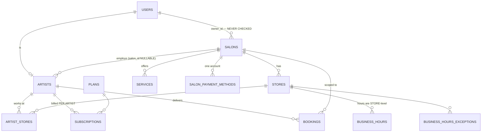
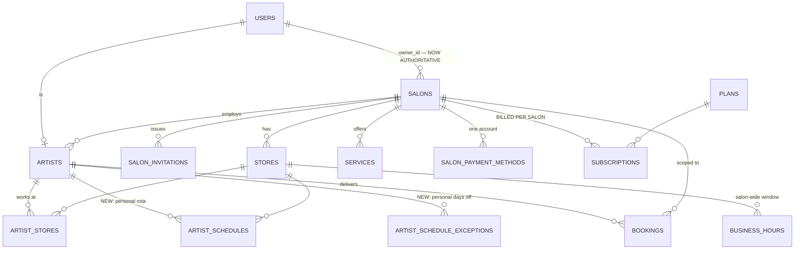

# B-Edge — Multi-Artist Salon Support
## Database Structure Document · v1

**Date:** 2026-09-21 · **Status:** Draft for approval
**Baseline:** 45 migrations on disk, latest `045_notification_delivery_truth`.
**New migrations start at 046.**
All current-state facts were read from the live `bedge-postgres` catalogue on 2026-09-21.

---

## 1. Current state

### 1.1 The two scoping axes

Every domain table hangs off one or both of `salon_id` and `artist_id`.

| Scope | Tables |
|---|---|
| **Salon-scoped** (shared by the whole salon) | `artists`, `audit_events`, `bookings`, `client_notes`, `discounts`, `orders`, `products`, `salon_payment_methods`, `services`, `stores` |
| **Artist-scoped** (belongs to one artist) | `artist_store_buffers`, `artist_stores`, `bookings`, `client_notes`, `invoices`, `reports`, `reviews`, `subscriptions`, `waitlist_entries` |
| **Both** — already correctly dual-scoped | `bookings`, `client_notes` |
| **Store-scoped** — *the G3 problem* | `business_hours`, `business_hours_exceptions` |

`bookings` and `client_notes` appearing in both columns is **good news**: the two tables
where "which artist, within which salon" genuinely matters already record both.

### 1.2 Tables as they stand

```sql
-- verified 2026-09-21
salons (
  id, owner_id NOT NULL, name NOT NULL, name_ar,
  subscription_plan NOT NULL, plan_expires_at,
  is_active NOT NULL, created_at, updated_at, deleted_at
)

artists (
  id, user_id NOT NULL, salon_id,            -- NULLABLE: the hook this feature uses
  bio, bio_ar, instagram, rating NOT NULL, review_count NOT NULL,
  is_verified NOT NULL, category, avatar_url, handle, status NOT NULL,
  created_at, updated_at
)
-- CHECK status   IN ('pending','active','rejected')
-- CHECK category IN ('makeup','hair','nails','lashes','skincare')
-- CHECK handle   ~ '^[a-z0-9]([a-z0-9-]*[a-z0-9])?$'

stores (id, salon_id, name, name_ar, address, city, country, phone,
        same_day_notice_hours, early_bird_cutoff, early_bird_fee,
        weekday_buffer_min, weekend_buffer_min, is_active,
        timezone, latitude, longitude, rating, review_count, …)

business_hours            (id, store_id, day_of_week, open_time, close_time, is_open, …)
business_hours_exceptions (id, store_id, exception_date, is_closed, open_time, close_time, reason, …)

artist_stores        (id, artist_id, store_id, created_at)   -- membership link, no schedule
artist_store_buffers (id, artist_id, from_store_id, to_store_id,
                      weekday_buffer_min, weekend_buffer_min, created_at)

salon_payment_methods (id, salon_id, method, account_name, account_ref, is_active, …)
                      -- NOTE: no artist_id — one account per salon (G5)

subscriptions (… artist_id …)   -- per artist, not per salon (G4)

plans (code, name, monthly_price, currency,
       seat_price, included_seats,           -- EXIST, POPULATED, NEVER CALCULATED WITH
       description, features, is_public, sort_order, …)
```

### 1.3 The seat columns — populated and dead

| code | monthly_price | included_seats | seat_price |
|---|---:|---:|---:|
| `starter` | 7.00 | 1 | 0.00 |
| `growth` | 15.00 | 1 | 0.00 |
| `studio` | 25.00 | 2 | 6.00 |
| `multi` | 50.00 | 5 | 6.00 |
| `enterprise` | 80.00 | 5 | 8.00 |
| `comped` | 0.00 | 999 | 0.00 |

These columns are created, seeded, read into `billing.Plan`, writable through the admin
plan CRUD — and referenced by **no arithmetic anywhere**. The invoice amount is
`Amount: sub.MonthlyPrice` (`internal/billing/service.go:363`), flat.

**Someone designed seat billing and stopped before the multiplication.** That is a gift:
the pricing model is already agreed and seeded, and G4 is one expression plus a regrain.

### 1.4 Current ERD — the multi-artist-relevant slice



Three problems are visible in the diagram alone: `owner_id` leads nowhere, hours hang off
`STORES` with no path to `ARTISTS`, and `SUBSCRIPTIONS` hangs off `ARTISTS` instead of
`SALONS`.

---

## 2. Target state

### 2.1 Target ERD



### 2.2 New table — `salon_invitations`

```sql
CREATE TABLE salon_invitations (
    id           UUID PRIMARY KEY DEFAULT gen_random_uuid(),
    salon_id     UUID NOT NULL REFERENCES salons(id) ON DELETE CASCADE,
    invited_by   UUID NOT NULL REFERENCES users(id),
    phone        VARCHAR(20),
    email        VARCHAR(255),
    token_hash   TEXT NOT NULL,
    status       VARCHAR(20) NOT NULL DEFAULT 'pending',
    expires_at   TIMESTAMPTZ NOT NULL,
    accepted_by  UUID REFERENCES users(id),
    accepted_at  TIMESTAMPTZ,
    created_at   TIMESTAMPTZ NOT NULL DEFAULT now(),
    updated_at   TIMESTAMPTZ NOT NULL DEFAULT now(),

    CONSTRAINT salon_invitations_status_check
        CHECK (status IN ('pending','accepted','declined','revoked','expired')),
    CONSTRAINT salon_invitations_contact_check
        CHECK (phone IS NOT NULL OR email IS NOT NULL),
    CONSTRAINT salon_invitations_accepted_check
        CHECK ((status = 'accepted') = (accepted_by IS NOT NULL))
);

-- at most one live invitation per contact per salon (FR-M7: resend, never duplicate)
CREATE UNIQUE INDEX uq_salon_invitations_live_phone
    ON salon_invitations (salon_id, phone)
    WHERE status = 'pending' AND phone IS NOT NULL;
CREATE UNIQUE INDEX uq_salon_invitations_live_email
    ON salon_invitations (salon_id, lower(email))
    WHERE status = 'pending' AND email IS NOT NULL;

CREATE INDEX idx_salon_invitations_token ON salon_invitations (token_hash);
CREATE INDEX idx_salon_invitations_salon ON salon_invitations (salon_id, status);
```

**Design notes.**
- `token_hash`, never the token. Consistent with `internal/pkg/hash`; a leaked database
  dump must not yield working invitation links.
- `phone` is stored **E.164-normalised** by `internal/pkg/phone` before insert. The partial
  unique index is worthless against `70555123` vs `+96170555123` otherwise — this is the
  exact equivalence that FRAUD-09 tested for deposit payers.
- The `accepted_check` biconditional stops a row claiming `accepted` with no acceptor.
- **No expiry job.** `expired` is computed on read and written back lazily, matching how
  booking holds self-heal.

### 2.3 New table — `artist_schedules` (G3, FR-S1)

```sql
CREATE TABLE artist_schedules (
    id          UUID PRIMARY KEY DEFAULT gen_random_uuid(),
    artist_id   UUID NOT NULL REFERENCES artists(id) ON DELETE CASCADE,
    store_id    UUID NOT NULL REFERENCES stores(id)  ON DELETE CASCADE,
    day_of_week SMALLINT NOT NULL CHECK (day_of_week BETWEEN 0 AND 6),
    start_time  TIME NOT NULL,
    end_time    TIME NOT NULL,
    is_working  BOOLEAN NOT NULL DEFAULT TRUE,
    created_at  TIMESTAMPTZ NOT NULL DEFAULT now(),
    updated_at  TIMESTAMPTZ NOT NULL DEFAULT now(),

    CONSTRAINT artist_schedules_range_check CHECK (start_time < end_time),
    CONSTRAINT uq_artist_schedules UNIQUE (artist_id, store_id, day_of_week)
);
CREATE INDEX idx_artist_schedules_lookup ON artist_schedules (artist_id, store_id);
```

> **The most important line in this document.**
> **Absence of a row means "available for the whole store window", not "unavailable".**
> This is what makes the change invisible to the five existing soloists, none of whom will
> have rows. `UNIQUE (artist_id, store_id, day_of_week)` deliberately permits only one
> window per day in v1 — split shifts (09:00–13:00, 17:00–21:00) would need the constraint
> relaxed and the intersection function generalised to an interval *set*. Recorded here so
> the limitation is a decision, not a discovery.

```sql
CREATE TABLE artist_schedule_exceptions (
    id             UUID PRIMARY KEY DEFAULT gen_random_uuid(),
    artist_id      UUID NOT NULL REFERENCES artists(id) ON DELETE CASCADE,
    store_id       UUID REFERENCES stores(id) ON DELETE CASCADE,  -- NULL = all stores
    exception_date DATE NOT NULL,
    is_unavailable BOOLEAN NOT NULL DEFAULT TRUE,
    start_time     TIME,
    end_time       TIME,
    reason         VARCHAR(255),
    created_at     TIMESTAMPTZ NOT NULL DEFAULT now(),

    CONSTRAINT ase_times_check CHECK (
        (is_unavailable AND start_time IS NULL AND end_time IS NULL)
     OR (NOT is_unavailable AND start_time IS NOT NULL
         AND end_time IS NOT NULL AND start_time < end_time)
    ),
    CONSTRAINT uq_ase UNIQUE (artist_id, store_id, exception_date)
);
```

Mirrors `business_hours_exceptions` on purpose: same shape, same semantics, one level down.

### 2.4 Altered table — `subscriptions` (G4)

**Additive, in three migrations.** Never a destructive rewrite — this table carries live
billing history (R4).

```sql
-- 049: add, nullable
ALTER TABLE subscriptions ADD COLUMN salon_id UUID REFERENCES salons(id);

-- 050: backfill, then enforce
UPDATE subscriptions s
   SET salon_id = a.salon_id
  FROM artists a
 WHERE a.id = s.artist_id AND a.salon_id IS NOT NULL;

ALTER TABLE subscriptions ALTER COLUMN salon_id SET NOT NULL;
CREATE UNIQUE INDEX uq_subscriptions_active_salon
    ON subscriptions (salon_id)
    WHERE cancelled_at IS NULL;

-- 051: relax the old grain (kept, not dropped, for audit continuity)
ALTER TABLE subscriptions ALTER COLUMN artist_id DROP NOT NULL;
COMMENT ON COLUMN subscriptions.artist_id IS
  'Historical grain. Billing moved to salon_id in migration 049-051 (2026-09). '
  'Retained so pre-migration invoices remain attributable. Do not read for billing.';
```

**Migration 050 will fail loudly if two artists in one salon each hold an uncancelled
subscription** — the partial unique index refuses it. That cannot happen with today's data
(every salon has exactly one artist) and is the correct outcome if it ever could: silently
merging two live subscriptions would destroy billing history. Verify before running:

```sql
SELECT a.salon_id, count(*) FROM subscriptions s JOIN artists a ON a.id = s.artist_id
 WHERE s.cancelled_at IS NULL GROUP BY 1 HAVING count(*) > 1;   -- must return 0 rows
```

### 2.5 Altered table — `salons`

```sql
ALTER TABLE salons
  ADD CONSTRAINT salons_owner_fk FOREIGN KEY (owner_id) REFERENCES users(id);
```

`owner_id` has been `NOT NULL` since 001 and is about to become an **authorisation
primitive**. It should be referentially enforced before code depends on it. Verify first:

```sql
SELECT s.id FROM salons s LEFT JOIN users u ON u.id = s.owner_id WHERE u.id IS NULL;
```

### 2.6 The orphan artist — investigated 2026-09-21

One artist has `salon_id IS NULL`. **Resolved by hand, as T0.4 required**; an automated
`UPDATE` that invents a salon for an unexplained row is how the `schema_migrations`
dirty-state incident happened (a version was forced after spot-checking a sample, and
migration 038 turned out never to have been applied).

What it turned out to be:

| | |
|---|---|
| Account | `testartist@bedge.com`, created 2026-06-14 |
| State | `status='active'`, `category='hair'`, no handle, no salon |
| Footprint | **0** bookings · **0** reviews · **0** `artist_stores` · **1 subscription** |
| Roster | Not part of the permanent 14-account roster |

**Decision: leave the artist row alone.** It is inert. With `salon_id IS NULL` the token
carries no `salon_id`, `salonrole.Resolve` returns `None`, and every guarded route refuses
with the pre-existing `NO_SALON` error — pinned by
`TestRequireSalonCapability_NoSalon_Returns403NoSalon`. Nothing needs repairing for
Phases 1 or 2.

> **Its subscription blocks migration 050.** The backfill is
> `UPDATE subscriptions … FROM artists a WHERE a.id = s.artist_id AND a.salon_id IS NOT
> NULL`, which skips this row, and the following `ALTER COLUMN salon_id SET NOT NULL`
> then fails. That is the migration doing its job — a subscription belonging to no salon
> has no meaning under the new grain — but it has to be decided before Phase 3 runs
> rather than discovered halfway through it. Run this first:
>
> ```sql
> SELECT s.id, s.status, s.cancelled_at
>   FROM subscriptions s JOIN artists a ON a.id = s.artist_id
>  WHERE a.salon_id IS NULL;     -- currently 1 row
> ```
>
> Cancel it, or give the artist a salon. Carried as a Phase 3 prerequisite in the plan.

### 2.7 Invariant I2 — verified 2026-09-21

All five salons pass: every `salons.owner_id` corresponds to an artist whose `salon_id`
is that salon. `owner_id` referential integrity is clean too — **0** salons reference a
non-existent user — so **migration 048 can add the foreign key with no repair pass**.

Checked rather than assumed. Nothing had ever enforced this invariant.

---

## 3. Migration sequence

| # | Name | Contents | Reversible |
|---|---|---|---|
| **046** | `salon_invitations` | §2.2 | Yes — drop table |
| **047** | `artist_schedules` | §2.3 both tables | Yes — drop tables |
| **048** | `salon_owner_fk` | §2.5 | Yes — drop constraint |
| **049** | `subscriptions_salon_id_add` | add nullable column | Yes |
| **050** | `subscriptions_salon_id_backfill` | backfill + NOT NULL + unique index | **Partially** — down drops the constraint and index, not the data |
| **051** | `subscriptions_artist_id_relax` | drop NOT NULL, add comment | Yes |

Each carries a prose header stating *why*, per project convention (010, 016, 029, 031 are
the standard to match).

**046–048 are additive and independently shippable.** 049–051 change the billing grain and
must land as a set, in order, against a verified-clean dataset.

---

## 4. Query changes

| Query | Today | Target |
|---|---|---|
| Slot generation | store hours − artist bookings | **(store hours ∩ artist schedule)** − artist bookings |
| Earnings | `WHERE artist_id = $1` ×3 (`earnings/repository.go:69,109,146`) | member: unchanged · owner: `artist_id IN (SELECT id FROM artists WHERE salon_id = $1)` + `GROUP BY artist_id` |
| Subscription lookup | `WHERE artist_id = $1` | `WHERE salon_id = $1 AND cancelled_at IS NULL` |
| Invoice amount | `Amount: sub.MonthlyPrice` | `monthly_price + GREATEST(0, active_members − included_seats) × seat_price` |
| Active member count | *(does not exist)* | `SELECT count(*) FROM artists WHERE salon_id=$1 AND status='active'` |
| Discovery visibility | `subscriptionVisibleCond` in **3 files** | unchanged shape, but resolved via the **salon's** subscription |

> **The discovery row is a live hazard.** `subscriptionVisibleCond` is hand-copied into
> `internal/discovery`, `internal/artist` and `internal/share`. On 2026-09-20 one copy was
> corrected and the other two were not; the divergence was found on 2026-09-21 by FRAUD-10,
> after a cancelled artist stayed reachable through their share link. Regraining the
> subscription touches **all three copies**, and the plan must treat "unify them first" as
> a prerequisite rather than trusting three parallel edits.

---

## 5. Data integrity invariants

Each is a testable assertion; each becomes a check in `scripts/verify-uc*.py`.

| # | Invariant |
|---|---|
| **I1** | Every `artists.salon_id` that is non-NULL references an existing, non-deleted salon. |
| **I2** | Every salon's `owner_id` corresponds to an artist whose `salon_id` is that salon (BR-2). |
| **I3** | Exactly one uncancelled subscription per salon. |
| **I4** | No salon has zero active members while holding active stores or services (BR-3). |
| **I5** | Every `artist_schedules` row's `(artist_id, store_id)` pair exists in `artist_stores`. |
| **I6** | No `pending` invitation past `expires_at` survives a read of that invitation. |
| **I7** | Every `salon_invitations.phone` is E.164 — the partial unique index is otherwise bypassable. |
| **I8** | Active member count ≤ `included_seats` + billed extra seats. |

**I2 does not hold today**: five salons exist where the relationship was never enforced,
and one artist has no salon at all. It must be verified — and repaired by hand where it
fails — before migration 048 adds the foreign key.

---

## 6. Rollback

| Migration | Rollback |
|---|---|
| 046, 047 | Drop the tables. No other table references them. |
| 048 | Drop the constraint. |
| 049–051 | Must roll back **as a set, in reverse**. 051 → restore `artist_id NOT NULL`; 050 → drop index and constraint (backfilled data is left in place, harmless); 049 → drop the column. |

Per convention, `.down.sql` is written and executed against a **copy** before the `.up`
ships. Migration 038 was never applied and went unnoticed for weeks; the migration table is
not trustworthy on inspection alone.

---

*Companion documents: `B-Edge-Multi-Artist-Salon-BRD-v1.md` ·
`B-Edge-Multi-Artist-Salon-HLD-v1.md` · `B-Edge-Multi-Artist-Salon-LLD-v1.md` ·
`B-Edge-Multi-Artist-Salon-Plan-v1.md`*
