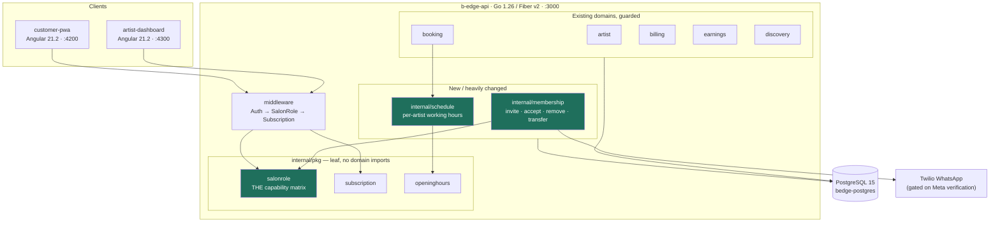
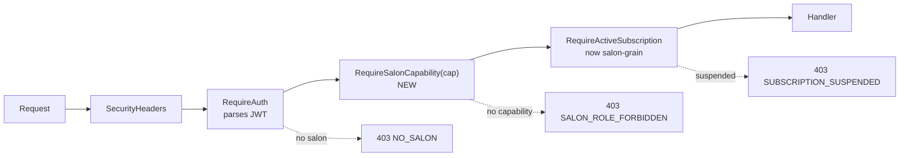
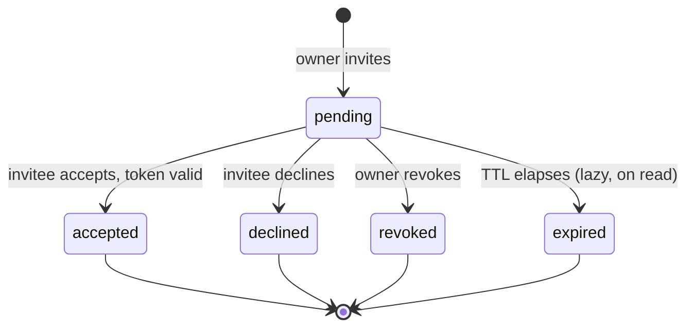
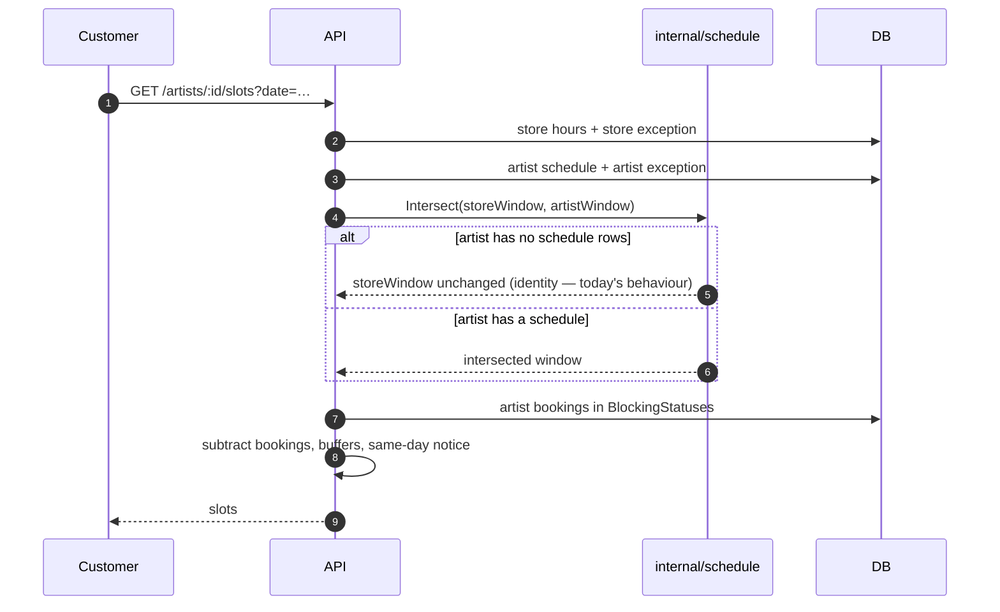
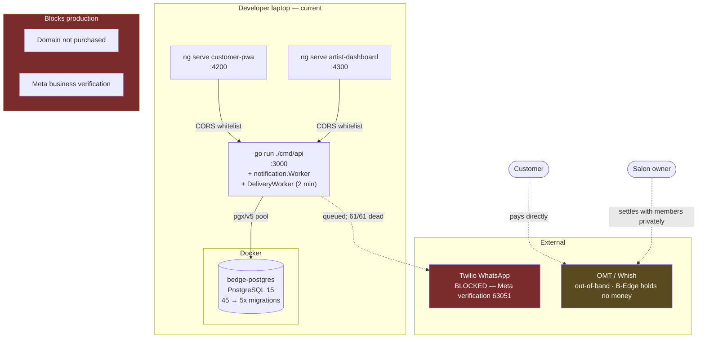

# B-Edge — Multi-Artist Salon Support
## High Level Design · v1

**Date:** 2026-09-21 · **Status:** Draft for approval
**Implements:** `B-Edge-Multi-Artist-Salon-BRD-v1.md`
**Next migration number:** 046 (45 on disk, latest `045_notification_delivery_truth`)

---

## 1. The architectural thesis

> **The schema is already salon-shaped. The application is soloist-shaped. This is an
> authorisation and scheduling problem, not a re-architecture.**

Ten tables carry `salon_id`. Handlers already call `SalonIDFromContext(c)` and pass it into
services. What is missing is one question the code has never had to ask — *which member of
this salon is asking?* — and one axis the scheduler has never had — *when does this
particular artist work?*

Everything below follows from those two sentences. Estimated shape: **one sprint of
authorisation work plus one sprint of scheduling**, not a rebuild.

---

## 2. Principles this design is bound by

These come from `project-docs/CLAUDE.md` and from the defect history. They are constraints,
not preferences.

**P1 — A rule lives in one place.** The single most expensive recurring defect in this
project is a rule written correctly once and not consulted elsewhere:
`subscriptionVisibleCond` existed as three hand-written copies in `discovery`, `artist` and
`share`; one was fixed on 2026-09-20 and the other two were found still broken on
2026-09-21. The capability matrix introduced here is the highest-risk candidate to repeat
that, so it ships as **one table in one leaf package**, consulted by middleware, never
re-expressed as an inline conditional.

**P2 — Leaf packages break import cycles.** `billing/handler.go` imports `middleware`, so
`middleware` cannot import `billing` — hence `internal/pkg/subscription`. The new
authorisation rule is needed by middleware and by several domains, so it must be a leaf:
**`internal/pkg/salonrole`**.

**P3 — State is derived, never stored, and there is no scheduler.** Subscription status
comes from `DeriveStatus`; open/closed is computed per request; holds self-heal lazily.
Therefore: **the salon role is derived from `salons.owner_id`, never stored as a second
source of truth**, and seat count is derived by counting active members.

**P4 — Ownership failures return 404; caller-describing failures return 403.** A member
denied an owner-only write is being told something about *themselves*, so `403
SALON_ROLE_FORBIDDEN` joins the existing 403 list beside `NO_SALON` and `NOT_AN_ARTIST`.
A member reaching for another member's private object gets 404.

**P5 — Do not regress the soloist.** Every default is chosen so that a one-member salon
behaves exactly as it does today. This is why the artist schedule defaults to *the whole
store window* rather than to *nothing*.

---

## 3. System context



---

## 4. The authorisation model — the core of this design

### 4.1 Role resolution

The salon role is **derived**, never stored (P3):

```
salonRole(user) = owner  if salons.owner_id = user.id
                = member if artists.salon_id = salon.id
                = none   otherwise
```

It is resolved **once at token issue** and carried in the JWT, extending the existing claim:

```go
type Claims struct {
    UserID    uuid.UUID
    SalonID   *uuid.UUID
    Role      string          // unchanged: artist | admin | customer
    SalonRole salonrole.Role  // NEW: owner | member | "" 
    gojwt.RegisteredClaims
}
```

**Consequence to design for:** ownership transfer must invalidate both parties' tokens
(UC5, FR-M10), because a derived claim baked into a token is stale the moment the source
row changes. This is the price of not hitting the database on every request, and it is the
right trade — but it must be implemented, not assumed.

### 4.2 The capability matrix

One table. One function. In a leaf package so middleware and every domain can reach it.

| Capability | Owner | Member | Guards |
|---|:---:|:---:|---|
| `services:write` | ✅ | ❌ | service menu, prices, deposits |
| `stores:write` | ✅ | ❌ | stores, addresses, buffers, early-bird fee |
| `store_hours:write` | ✅ | ❌ | `business_hours`, `business_hours_exceptions` |
| `discounts:write` | ✅ | ❌ | `discounts` |
| `products:write` | ✅ | ❌ | `products`, `orders` fulfilment |
| `payment_methods:write` | ✅ | ❌ | `salon_payment_methods` |
| `billing:write` | ✅ | ❌ | subscription, invoices, plan changes |
| `members:write` | ✅ | ❌ | invite, remove, transfer |
| `members:read` | ✅ | ✅ | roster is visible to all members |
| `earnings:salon:read` | ✅ | ❌ | per-member breakdown, salon total |
| `calendar:salon:read` | ✅ | ❌ | all-member calendar |
| `bookings:any:write` | ✅ | ❌ | reassign, cancel another member's booking |
| `own_schedule:write` | ✅ | ✅ | `artist_schedules`, personal exceptions |
| `own_bookings:write` | ✅ | ✅ | confirm, complete, cancel, refund own |
| `own_profile:write` | ✅ | ✅ | bio, handle, portfolio, avatar |
| `own_earnings:read` | ✅ | ✅ | own earnings only |
| `client_notes:write` | ✅ | ✅ | salon-wide per D-MS3 |

**Why a matrix and not conditionals:** it is testable as data, in the shape of
`booking/statematrix_test.go` (7 actions × 11 statuses × 2 time positions = 154 asserted
cells). Adding a third role (D-MS10) becomes a new column, and the test fails until every
cell is filled — which is exactly the property that would have caught the
`subscriptionVisibleCond` triple-copy.

### 4.3 Middleware chain



`RequireSalonCapability` is a closure over one capability, registered per route group. It
calls `salonrole.Can(claims.SalonRole, cap)` and nothing else — no SQL, no second source.

---

## 5. Subsystem design

### 5.1 Membership (`internal/membership`) — new domain

Handles the entire lifecycle of a salon roster. The invitation is a **state machine**, and
the project's convention is to express those as data:



Expiry is **lazy on read**, matching how booking holds already self-heal (P3) — no cron.

The critical integration point is **G2**: today `internal/onboarding` creates salon +
artist + store in one transaction. Accepting an invitation must run artist onboarding with
**salon creation suppressed**, joining the existing salon instead. This is a branch in the
onboarding transaction, not a parallel code path — a second copy of onboarding is exactly
the P1 failure mode.

### 5.2 Scheduling (`internal/schedule`) — new leaf-adjacent domain

Today: `availability = store_hours − artist_bookings − buffers`
Target: `availability = (store_hours ∩ artist_schedule) − artist_bookings − buffers`

The intersection is a **pure function over intervals**, with no clock and no database —
consistent with how `internal/pkg/openinghours` is already built, and testable exhaustively.

**The defining default (FR-S2, P5):** an artist with *zero* schedule rows for a store is
treated as available for the **entire** store window. So today's five soloists, who will
have no rows, compute identical slots to today. The intersection is an identity operation
until someone opts in.

Precedent for the shape: `artist_store_buffers` already overrides a store-level setting
per artist. `artist_schedules` is the same idea applied to hours.

### 5.3 Billing (`internal/billing`) — regrained

Three changes, in dependency order:

1. **Regrain the subscription** from `artist_id` to `salon_id`.
2. **Make seats count.** `billing/service.go:363` is currently `Amount: sub.MonthlyPrice`.
   It becomes `monthly_price + max(0, active_members − included_seats) × seat_price`. The
   columns already exist and are already CRUD-plumbed — **only the arithmetic is missing.**
3. **Widen enforcement.** `subscription.Enforce(status)` already returns
   `{VisibleInDiscovery, AcceptsNewBookings, CanModifyAccount}`. Its input must become the
   *salon's* subscription so that a lapse suspends every member, not just the owner
   (FR-B5). The `Enforce` function itself does not change — only what is passed to it.

### 5.4 Earnings (`internal/earnings`) — scoped by role

`WHERE artist_id = $1` (three sites) becomes a role-dependent predicate: unchanged for a
member, widened to `artist_id IN (salon members)` for an owner, with a per-member
`GROUP BY`.

**The honest part.** Deposits land in the salon's single OMT/Whish account (G5, D-MS6).
B-Edge computes what each member earned and therefore what the owner owes them — and
**moves no money**. Every earnings surface must say so (FR-E4). This is not a limitation to
paper over; it is the platform's deliberate position, and a member who misreads a figure as
a payment received is a support incident and a trust failure.

### 5.5 Discovery & the customer funnel

`artists.salon_id` is already selectable. FR-C1/C2 is a profile-shape change — list the
salon's artists, let the customer pick — and the funnel already carries an artist ID
throughout. FR-C3 ("no preference") is deferred (D-MS11) because deterministic assignment
must interact with the GIST exclusion constraint, which `001_initial_schema` calls *"the
final atomic guard — no application-level check can replace it."* That deserves its own
design note, not an opportunistic implementation.

---

## 6. Key flows

### 6.1 Invite and accept

```mermaid
sequenceDiagram
  autonumber
  participant O as Owner
  participant API
  participant RL as pkg/salonrole
  participant DB
  participant TW as Twilio
  participant I as Invitee

  O->>API: POST /salon/members/invite {phone}
  API->>RL: Can(owner, members:write)
  RL-->>API: true
  API->>DB: count active members vs included_seats
  alt exceeds included seats
    API-->>O: 409 SEAT_CHARGE_REQUIRED {new_total}
    O->>API: POST …/invite {phone, accept_charge:true}
  end
  API->>DB: INSERT salon_invitations (pending, token)
  API->>DB: INSERT audit_events
  API->>TW: queue WhatsApp invitation
  Note over TW: dead until Meta verification clears — link<br/>must also be copyable from the dashboard
  I->>API: GET /invitations/:token
  API->>DB: validate (pending, unexpired, unused)
  I->>API: POST /invitations/:token/accept
  API->>DB: BEGIN
  API->>DB: onboarding WITHOUT salon creation
  API->>DB: artists.salon_id = salon; status='pending'
  API->>DB: invitation → accepted
  API->>DB: COMMIT
  API-->>I: awaiting admin approval
```

> **Operational note.** `TWILIO_WHATSAPP_FROM` is unset and every notification ever queued
> is `dead` (61 of 61). The invitation link must therefore be **displayable and copyable in
> the owner's dashboard**, not delivered only by WhatsApp. Designing around the WhatsApp
> path alone would ship a feature that cannot be used today.

### 6.2 Slot generation with per-artist hours



---

## 7. Implementation / deployment view



**What this feature adds to the runtime:** nothing. No new process, no new external
dependency, no scheduler. Membership expiry is lazy; seat counting is a query; role
resolution happens at token issue. The two background workers that exist
(`notification.Worker`, `DeliveryWorker`) are untouched.

**What it does not fix:** the two deployment blockers above are unchanged. Multi-artist
support can be built and tested locally in full, but an invited artist cannot receive a
WhatsApp invitation until Meta verification clears — hence the copyable-link requirement
in §6.1.

---

## 8. Risks

| # | Risk | Likelihood | Mitigation |
|---|---|---|---|
| **R1** | The capability check gets re-expressed inline in a handler, and a later fix updates one copy. **This is the project's signature defect.** | High | One leaf package; matrix test asserts every cell; a lint-style test greps `internal/` for `owner_id ==` outside `salonrole`. |
| **R2** | A stale `SalonRole` claim survives an ownership transfer, leaving two owners or none. | Medium | Transfer invalidates both refresh tokens; short access-token TTL; transfer is audited. |
| **R3** | The hours intersection changes slot output for existing soloists. | Medium | Golden-output tests captured **before** the change; the no-rows case must be provably an identity operation. |
| **R4** | Regraining `subscriptions` from artist to salon corrupts live billing history. | Medium | Additive migration: add `salon_id`, backfill, verify, only then relax `artist_id`. Never a destructive rewrite. |
| **R5** | A member reads another member's earnings through an unguarded route. | Medium | Negative test per route (NFR-4); earnings routes enumerated and each asserted. |
| **R6** | Seat charges surprise the owner and they churn. | Medium | FR-B3 makes acknowledgement explicit *before* the member becomes active. |
| **R7** | Members misread an earnings figure as money received. | High | FR-E4 — every surface states B-Edge moves no money. Copy, not code, and easy to omit. |

---

## 9. What this design deliberately does not do

- **No payouts, splits or commission processing.** B-Edge holds no money; Lebanon has no
  card rails. A scope boundary, not a backlog item.
- **No second onboarding path.** Accepting an invitation branches inside the existing
  onboarding transaction (P1).
- **No stored role column.** `salons.owner_id` is the single source (P3).
- **No cron.** Invitation expiry is lazy, like booking holds.
- **No multi-salon artists, no non-artist roles, no per-artist pricing** (D-MS2, D-MS9,
  D-MS10) — each is a column or a table away, none is v1.

---

*Companion documents: `B-Edge-Multi-Artist-Salon-BRD-v1.md` ·
`B-Edge-Multi-Artist-Salon-LLD-v1.md` · `B-Edge-Multi-Artist-Salon-Database-v1.md` ·
`B-Edge-Multi-Artist-Salon-Plan-v1.md`*
