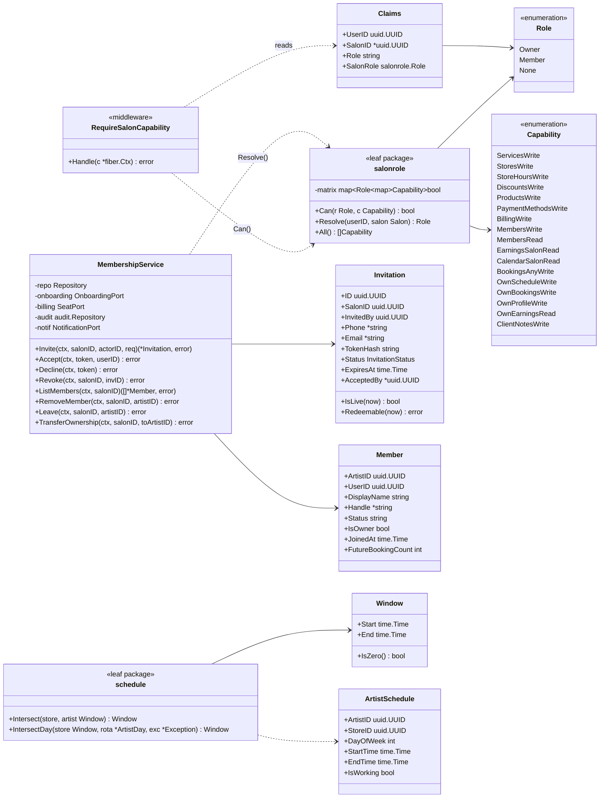
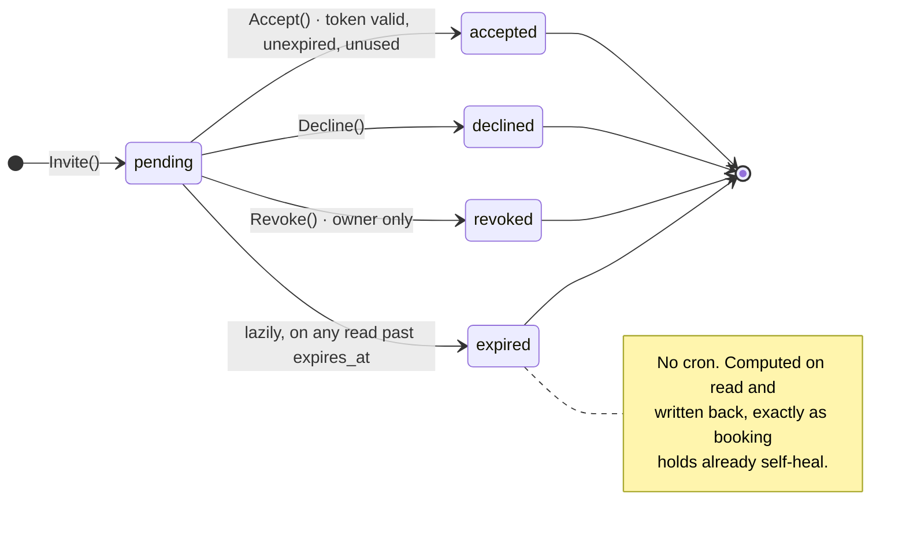

# B-Edge — Multi-Artist Salon Support
## Low Level Design & UML · v1

**Date:** 2026-09-21 · **Status:** Draft for approval
**Implements:** `B-Edge-Multi-Artist-Salon-HLD-v1.md`
**House style:** in-package tests, hand-written mocks, `newTestService()`,
`Test<Method>_<Condition>_<Expected>`, no table-driven, no `t.Run`, decimals via `.Equal()`.

---

## 1. Package layout

```
internal/
  pkg/
    salonrole/            NEW · leaf · imports nothing from internal/
      role.go             Role, Capability, the matrix, Can()
      role_test.go        every cell asserted
    schedule/             NEW · leaf · pure interval algebra, no clock, no DB
      window.go           Window, Intersect, IntersectDay
      window_test.go
  membership/             NEW domain
    model.go  service.go  repository.go  handler.go  routes.go
  middleware/
    salonrole.go          NEW · RequireSalonCapability(cap)
    billing.go            CHANGED · subscription lookup regrained to salon
  onboarding/
    repository.go         CHANGED · CompleteWithoutSalon branch (G2)
  booking/
    service.go            CHANGED · intersect artist schedule into slot generation
  billing/
    service.go            CHANGED · seat arithmetic; salon-grain subscription
    repository.go         CHANGED · salon_id queries
  earnings/
    service.go            CHANGED · role-scoped predicate
    repository.go         CHANGED · owner breakdown query
  artist/ discovery/ share/
    repository.go         CHANGED · subscriptionVisibleCond unified, then regrained
```

**Why `salonrole` and `schedule` are leaves.** `billing/handler.go` imports `middleware`,
so `middleware` cannot import `billing` — the same cycle that produced
`internal/pkg/subscription`. `middleware` must consult the capability matrix, therefore the
matrix cannot live in a domain package. `schedule` is a leaf for a different reason: it is
a pure function over intervals and should be exhaustively testable without a database.

---

## 2. UML — class diagram



---

## 3. `internal/pkg/salonrole` — the single source of truth

```go
// Package salonrole holds the one authoritative answer to "may this member of a
// salon do this?".
//
// It is a leaf package for the same reason internal/pkg/subscription is one:
// internal/middleware must consult it, and several domain packages import
// middleware, so the rule cannot live in a domain.
//
// DO NOT re-express any row of this matrix as an inline conditional. The most
// expensive recurring defect in this project is a rule written correctly in one
// place and hand-copied to another: subscriptionVisibleCond existed as three
// copies in discovery, artist and share; one was fixed on 2026-09-20 and the
// other two were still wrong on 2026-09-21, leaving a cancelled artist bookable
// through their share link. This package exists so that cannot recur here.
package salonrole

type Role string

const (
	None   Role = ""
	Owner  Role = "owner"
	Member Role = "member"
)

type Capability string

const (
	ServicesWrite       Capability = "services:write"
	StoresWrite         Capability = "stores:write"
	StoreHoursWrite     Capability = "store_hours:write"
	DiscountsWrite      Capability = "discounts:write"
	ProductsWrite       Capability = "products:write"
	PaymentMethodsWrite Capability = "payment_methods:write"
	BillingWrite        Capability = "billing:write"
	MembersWrite        Capability = "members:write"
	MembersRead         Capability = "members:read"
	EarningsSalonRead   Capability = "earnings:salon:read"
	CalendarSalonRead   Capability = "calendar:salon:read"
	BookingsAnyWrite    Capability = "bookings:any:write"
	OwnScheduleWrite    Capability = "own_schedule:write"
	OwnBookingsWrite    Capability = "own_bookings:write"
	OwnProfileWrite     Capability = "own_profile:write"
	OwnEarningsRead     Capability = "own_earnings:read"
	ClientNotesWrite    Capability = "client_notes:write"
)

// matrix is the whole policy. Every capability appears under every role, with an
// explicit true or false — never an omission. role_test.go fails if any cell is
// missing, so adding a Capability or a Role forces a deliberate decision rather
// than defaulting to deny-by-absence.
var matrix = map[Role]map[Capability]bool{
	Owner: {
		ServicesWrite: true, StoresWrite: true, StoreHoursWrite: true,
		DiscountsWrite: true, ProductsWrite: true, PaymentMethodsWrite: true,
		BillingWrite: true, MembersWrite: true, MembersRead: true,
		EarningsSalonRead: true, CalendarSalonRead: true, BookingsAnyWrite: true,
		OwnScheduleWrite: true, OwnBookingsWrite: true, OwnProfileWrite: true,
		OwnEarningsRead: true, ClientNotesWrite: true,
	},
	Member: {
		ServicesWrite: false, StoresWrite: false, StoreHoursWrite: false,
		DiscountsWrite: false, ProductsWrite: false, PaymentMethodsWrite: false,
		BillingWrite: false, MembersWrite: false, MembersRead: true,
		EarningsSalonRead: false, CalendarSalonRead: false, BookingsAnyWrite: false,
		OwnScheduleWrite: true, OwnBookingsWrite: true, OwnProfileWrite: true,
		OwnEarningsRead: true, ClientNotesWrite: true,
	},
}

func Can(r Role, c Capability) bool { return matrix[r][c] }

// Resolve derives the role. salons.owner_id is the only source; the role is
// never stored a second time (see HLD P3).
func Resolve(userID uuid.UUID, salonOwnerID uuid.UUID, hasSalon bool) Role {
	switch {
	case !hasSalon:
		return None
	case userID == salonOwnerID:
		return Owner
	default:
		return Member
	}
}
```

### 3.1 Matrix test — `role_test.go`

Modelled on `booking/statematrix_test.go`, which asserts 154 cells — every
cell's exact error code, and that a rejected action did not write the row.

> **Correction, 2026-09-23.** An earlier version of this line said that
> file is *"mutation-tested"*. **It is not, and never was — there is no
> mutation tooling in this repository.** The claim was written here,
> repeated into a reliability assessment as evidence, and nothing ever
> checked it. That is the same defect class the matrix itself exists to
> catch, living in documentation rather than code. Mutation testing is
> planned as W2.1–W2.3 of `B-Edge-Reliability-Plan-v1.md`; until that
> lands, the matrix's strength is its completeness, not a survival rate.

```go
func TestMatrix_EveryCapabilityDecidedForEveryRole(t *testing.T) {
    for _, r := range []Role{Owner, Member} {
        for _, c := range All() {
            if _, ok := matrix[r][c]; !ok {
                t.Fatalf("capability %q has no decision for role %q — "+
                    "add it to the matrix deliberately, do not rely on the zero value", c, r)
            }
        }
    }
}

func TestCan_NoneRoleHasNothing(t *testing.T)     // Resolve → None grants zero capabilities
func TestCan_OwnerIsSupersetOfMember(t *testing.T) // every member capability is an owner capability
```

`TestCan_OwnerIsSupersetOfMember` pins a real invariant: there must be nothing a member can
do that the owner cannot, or a soloist who transfers ownership would *lose* abilities.

### 3.2 Anti-drift guard

```go
// TestNoInlineOwnerChecks parses internal/ and fails if "owner_id" appears in a
// comparison outside internal/pkg/salonrole and internal/membership/repository.go.
// Same technique as booking/columns_test.go, which parses its own source to keep
// bookingSelectCols and scanBooking in agreement.
func TestNoInlineOwnerChecks(t *testing.T)
```

This is the concrete defence against R1. Without it, P1 is a comment rather than a
constraint.

---

## 4. `internal/middleware/salonrole.go`

```go
// RequireSalonCapability refuses a request whose salon role lacks cap.
//
// Returns 403 SALON_ROLE_FORBIDDEN, not 404. The project's convention is that
// ownership failures return 404 so object IDs cannot be enumerated — but this
// describes the CALLER, not an object, so it joins NO_SALON, NOT_AN_ARTIST and
// SUBSCRIPTION_SUSPENDED in the deliberate 403 list. The member already knows
// the salon's services exist; they are standing in the salon.
func RequireSalonCapability(cap salonrole.Capability) fiber.Handler {
	return func(c *fiber.Ctx) error {
		claims, ok := ClaimsFromContext(c)
		if !ok {
			return apperror.Unauthorized("UNAUTHENTICATED", "authentication required")
		}
		if claims.SalonID == nil {
			return apperror.Forbidden("NO_SALON", "no salon is associated with this account")
		}
		if !salonrole.Can(claims.SalonRole, cap) {
			return apperror.Forbidden("SALON_ROLE_FORBIDDEN",
				"only the salon owner can do this")
		}
		return c.Next()
	}
}
```

### 4.1 Route registration

The guard is applied per route group. Registration is the surface where a capability can be
silently forgotten, so §8 requires a test that enumerates registered routes.

```go
// internal/artist/routes.go
svc := g.Group("/salon/services", mw.RequireAuth, mw.RequireSalonCapability(salonrole.ServicesWrite))
svc.Post("/",    h.CreateService)
svc.Patch("/:id", h.UpdateService)
svc.Delete("/:id", h.DeleteService)

// reads stay open to every member — no capability guard
g.Get("/salon/services", mw.RequireAuth, h.ListServices)
```

---

## 5. `internal/pkg/schedule` — the intersection

```go
// Package schedule intersects a store's opening window with an artist's personal
// rota. Pure: no clock, no database, no logging.
package schedule

type Window struct{ Start, End time.Time }

func (w Window) IsZero() bool { return !w.Start.Before(w.End) }

// Intersect returns the overlap. A zero artist window means THE ARTIST HAS
// DECLARED NO ROTA, which means "available for the whole store window" — not
// "unavailable".
//
// This default is load-bearing. Every artist on the platform today has no rota
// rows, so Intersect must be an identity operation for them or the feature
// silently empties five live calendars.
func Intersect(store, artist Window) Window {
	if artist.IsZero() {
		return store
	}
	if store.IsZero() {
		return Window{}
	}
	s, e := store.Start, store.End
	if artist.Start.After(s) { s = artist.Start }
	if artist.End.Before(e)  { e = artist.End }
	if !s.Before(e) { return Window{} }
	return Window{Start: s, End: e}
}
```

### 5.1 Tests that must exist

| Test | Asserts |
|---|---|
| `TestIntersect_NoArtistRota_ReturnsStoreWindowUnchanged` | **the identity property — the single most important test in this feature** |
| `TestIntersect_ArtistStartsLater_ClipsStart` | 09:00–18:00 ∩ 12:00–18:00 = 12:00–18:00 |
| `TestIntersect_ArtistEndsEarlier_ClipsEnd` | |
| `TestIntersect_Disjoint_ReturnsZero` | evening artist at a morning-only store |
| `TestIntersect_ArtistWiderThanStore_ReturnsStoreWindow` | an artist cannot extend opening hours |
| `TestIntersect_TouchingBoundaries_ReturnsZero` | 09:00–12:00 ∩ 12:00–18:00 — zero-length is not a slot |
| `TestIntersect_StoreClosed_ReturnsZero` | a rota cannot open a closed store |

---

## 6. `internal/membership`

### 6.1 Invitation state machine



### 6.2 API contracts

| Method | Path | Capability | Success | Failures |
|---|---|---|---|---|
| `POST` | `/api/v1/salon/members/invite` | `members:write` | 201 Invitation | 403 `SALON_ROLE_FORBIDDEN` · 409 `SEAT_CHARGE_REQUIRED` · 409 `ALREADY_IN_SALON` · 409 `INVITATION_EXISTS` · 422 validation |
| `GET` | `/api/v1/salon/members` | `members:read` | 200 `[]Member` | 403 `NO_SALON` |
| `DELETE` | `/api/v1/salon/members/:artistId` | `members:write` | 204 | 403 · 404 · 409 `HAS_FUTURE_BOOKINGS` · 409 `CANNOT_REMOVE_OWNER` |
| `POST` | `/api/v1/salon/members/leave` | *(any member)* | 204 | 409 `LAST_MEMBER` · 409 `HAS_FUTURE_BOOKINGS` · 409 `OWNER_MUST_TRANSFER` |
| `POST` | `/api/v1/salon/owner/transfer` | `members:write` | 200 | 403 · 404 · 409 `TARGET_NOT_ACTIVE_MEMBER` |
| `DELETE` | `/api/v1/salon/invitations/:id` | `members:write` | 204 | 403 · 404 |
| `GET` | `/api/v1/invitations/:token` | *(public)* | 200 preview | 404 `INVITATION_NOT_FOUND` · 410 `INVITATION_EXPIRED` |
| `POST` | `/api/v1/invitations/:token/accept` | *(authenticated)* | 200 | 404 · 410 · 409 `ALREADY_IN_SALON` |
| `PUT` | `/api/v1/artists/me/schedule` | `own_schedule:write` | 200 | 403 · 422 |
| `GET` | `/api/v1/salon/earnings/breakdown` | `earnings:salon:read` | 200 | 403 |

**`GET /invitations/:token` is public and therefore an enumeration surface.** It must
return the salon name and inviter's display name and **nothing else** — no member list, no
phone numbers, no revenue. Unknown, expired and revoked tokens must be indistinguishable in
timing and shape, for the same reason `errBookingNotFound` has one constructor: two
literals that happen to agree is how the original 403/404 leak survived.

### 6.3 Service signatures

```go
type Repository interface {
	CreateInvitation(ctx, *Invitation) error
	InvitationByTokenHash(ctx, hash string) (*Invitation, error)
	InvitationByID(ctx, salonID, id uuid.UUID) (*Invitation, error)
	UpdateInvitationStatus(ctx, id uuid.UUID, st InvitationStatus, by *uuid.UUID) error
	LiveInvitationForContact(ctx, salonID uuid.UUID, phone, email *string) (*Invitation, error)

	ListMembers(ctx, salonID uuid.UUID) ([]*Member, error)
	ActiveMemberCount(ctx, salonID uuid.UUID) (int, error)
	FutureBookingCount(ctx, artistID uuid.UUID, from time.Time) (int, error)
	SetArtistSalon(ctx, artistID uuid.UUID, salonID *uuid.UUID) error
	SalonOwner(ctx, salonID uuid.UUID) (uuid.UUID, error)
	SetSalonOwner(ctx, salonID, userID uuid.UUID) error
}

// OnboardingPort is the seam that prevents a second onboarding path (HLD P1).
// internal/onboarding grows one exported method; membership does not
// reimplement salon-less artist creation.
type OnboardingPort interface {
	CompleteIntoExistingSalon(ctx context.Context, userID, salonID uuid.UUID,
		req onboarding.ArtistProfile) (artistID uuid.UUID, err error)
}

type SeatPort interface {
	SeatImpact(ctx context.Context, salonID uuid.UUID, delta int) (SeatQuote, error)
}
```

### 6.4 Invite — the ordering that matters

```go
func (s *service) Invite(ctx context.Context, salonID, actorID uuid.UUID,
	req InviteRequest) (*Invitation, error) {

	// 1. Normalise the phone BEFORE any uniqueness check. "70555123" and
	//    "+96170555123" are one number; the partial unique index cannot see
	//    that, and neither could the deposit-payer comparison until FRAUD-09.
	var phone *string
	if req.Phone != "" {
		n, err := phone.Normalize(req.Phone, "LB")
		if err != nil { return nil, errInvalidPhone }
		phone = &n
	}

	// 2. Refuse if the contact already belongs to a salon (BR-1, FR-M5).
	// 3. Resend rather than duplicate an existing live invitation (FR-M7).
	// 4. Seat capacity. Refuse with SEAT_CHARGE_REQUIRED unless acknowledged (FR-B3).
	// 5. Generate the token; store ONLY the hash.
	// 6. Insert + audit in one transaction.
	// 7. Queue the notification OUTSIDE the transaction — a Twilio failure must
	//    not roll back the invitation, and every notification is currently dead.
}
```

Step 7 is not a detail. `TWILIO_WHATSAPP_FROM` is unset and 61 of 61 notifications ever
queued are `dead`. If delivery were inside the transaction, no invitation could be created
at all today.

---

## 7. Changes to existing code

| File | Change | Risk |
|---|---|---|
| `internal/pkg/jwt/jwt.go` | Add `SalonRole` to `Claims`. | Low — additive; old tokens decode with `None` and are refused by any guard, which is the safe direction. |
| `internal/domain/auth/service.go` | Resolve the role at token issue via `salonrole.Resolve`. | Low |
| `internal/onboarding/repository.go:63` | Extract the artist+store half of the transaction so it can run without creating a salon (G2). | **Medium** — the only salon creation path in the codebase. |
| `internal/booking/service.go` | Intersect the artist rota into slot generation. | **High** — touches the revenue path. Golden-output tests captured **before** the change. |
| `internal/billing/service.go:363` | `Amount: sub.MonthlyPrice` → seat arithmetic. | **High** — money. Use `internal/pkg/money`; never `decimal.NewFromString` on input. |
| `internal/middleware/billing.go` | Subscription lookup regrained to salon. | Medium |
| `internal/earnings/repository.go:69,109,146` | Role-scoped predicate. | Medium — three sites, same rule. **Extract it rather than editing three copies.** |
| `internal/{discovery,artist,share}/repository.go` | `subscriptionVisibleCond` — **unify the three copies first**, then regrain. | **High** — this exact triple already caused a live defect on 2026-09-20/21. |

---

## 8. Test plan

### Unit

| Package | Tests |
|---|---|
| `pkg/salonrole` | Matrix completeness · owner ⊇ member · `None` grants nothing · `Resolve` all three branches |
| `pkg/schedule` | The seven in §5.1, **identity first** |
| `membership` | Invite: normalisation, duplicate, cross-salon, seat gate. Accept: valid, expired, revoked, reused, already-in-salon. Remove: owner, future bookings, last member. Transfer: non-member target, token invalidation. |
| `billing` | Seat arithmetic: 0 extra, 1 extra, at the included boundary, `comped` (999 seats), `starter` (`seat_price=0` — extra seats must be **free, not an error**) |

### Integration — extend `scripts/verify-uc*.py`

A new `scripts/verify-uc7.py` (`make verify-uc7`), following the established rules: assert
identity before measuring, verify effects rather than status fields, SKIP loudly rather
than pass vacuously, create the conditions rather than wait for them, restore in `finally`.

| Check | Asserts |
|---|---|
| **MS1** | A member receives 403 `SALON_ROLE_FORBIDDEN` on every owner-only route — **enumerated from the router, not hand-listed**, so a new unguarded route fails the check |
| **MS2** | A member's `PATCH` to a service leaves the row **byte-identical** (effect, not status code) |
| **MS3** | A member's earnings response contains no other member's booking IDs |
| **MS4** | An artist with no rota rows produces **byte-identical slots** to the pre-migration baseline |
| **MS5** | An artist with a rota produces a strict subset |
| **MS6** | Two artists in one salon → exactly one uncancelled subscription (I3) |
| **MS7** | Invoice amount equals the seat formula for each of the six plans |
| **MS8** | A reused invitation token is refused |
| **MS9** | An expired invitation is indistinguishable from an unknown one |
| **MS10** | Removing a member leaves their bookings, reviews and earnings intact (BR-4) |
| **MS11** | Every invariant I1–I8 holds after the full migration set |

**MS4 is the regression gate for the whole feature.** Capture the baseline **before**
migration 047 ships:

```bash
./scripts/capture-slot-baseline.sh > project-docs/slot-baseline-pre-046.json
```

### E2E — new suite 22 in `b-edge-web/project-docs/E2E-TEST-PLAN.md`

22.1 owner invites, second artist accepts and appears in the roster · 22.2 member's
dashboard shows no Services/Stores/Billing navigation · 22.3 member sets a rota and the
customer funnel reflects it · 22.4 owner sees both members' earnings, member sees one ·
22.5 **a solo artist's dashboard is unchanged — no member UI anywhere** (NFR-1, the
acceptance criterion most likely to be quietly broken).

---

## 9. Frontend

**`artist-dashboard`** — a `salonRole` signal from the token drives navigation. Owner-only
routes are guarded by a route guard **and** hidden from the nav; hiding alone is not
authorisation, and the API guard is the real boundary.

> Angular gotcha, already paid for once in this project: **a signal `input()` is not bound
> until after construction.** Reading `salonRole()` in a constructor returns the declared
> default, which for a role signal means every member briefly renders as an owner. Seed in
> `ngOnInit`. This exact bug made four inputs silently inert in
> `guest-details-screen.component.ts`.

New screens: Team (roster, invite, remove), Invitation accept, My Schedule (weekly rota +
personal exceptions), Salon Earnings (owner only).

**`customer-pwa`** — artist list on a multi-artist salon profile; **unchanged for
one-member salons** (FR-C4).

`@bedge/shared` resolves to `./dist/shared`, so `ng build shared` runs before either app.

---

*Companion documents: `B-Edge-Multi-Artist-Salon-BRD-v1.md` ·
`B-Edge-Multi-Artist-Salon-HLD-v1.md` · `B-Edge-Multi-Artist-Salon-Database-v1.md` ·
`B-Edge-Multi-Artist-Salon-Plan-v1.md`*
