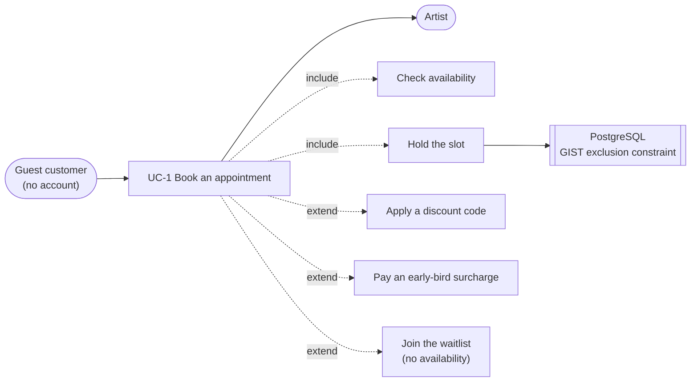
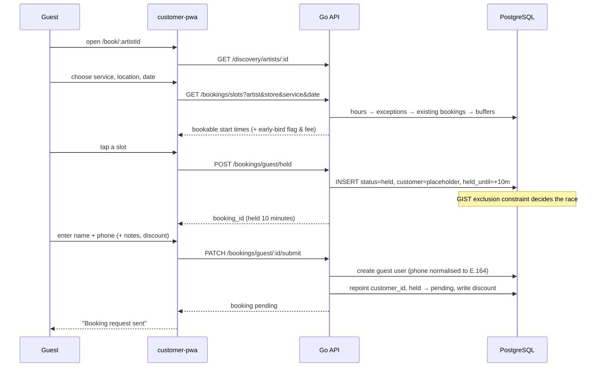

# UC-1 · Guest books an appointment — verification report

**Date:** 2026-09-19
**Method:** [B-Edge-Use-Case-Verification-Prompt-v1.md](./B-Edge-Use-Case-Verification-Prompt-v1.md)
**Executed against:** the running stack — real API, real PostgreSQL, real data
**Scope:** path 1 of 6. Paths 2–6 are not covered by this document.

---

## 0. Result

**17 flows enumerated, 17 executed, 0 defects found.**

That is the honest outcome and it is worth stating plainly: **the guest
booking path works, including under concurrency.** Six parallel holds on one
slot produced exactly one winner. The availability algorithm never offers a
start time that would run past closing. Exception closures override the
weekly pattern. The early-bird surcharge is charged, not merely advertised.

This matters because it relocates the problem. The defects that reached the
artist were **not** in this logic. They were in rendering, in cross-screen
consistency, and in delivery the system could not observe. Testing this path
harder would never have found them — which is itself the finding.

Three tests failed on first run and **none was a product defect**; all three
were faults in my own harness. They are recorded in §5 because a verification
report that hides its own false positives cannot be trusted on its passes.

---

## 1. Actors and use case

The guest never authenticates. Identity is collected at the last step and a
user row is created then — which is why the hold exists at all.

---

## 2. Basic flow

The hold is the load-bearing idea: it reserves the slot for ten minutes while
someone types, and it self-heals on expiry rather than needing a scheduler.

---

## 3. Flow enumeration and results

Every flow below was executed. "Evidence" is the actual observed response.

### Basic

| ID | Flow | Result | Evidence |
|---|---|---|---|
| B1 | Hold a free slot | ✅ | `201`, booking_id returned, status `held` |
| B2 | Submit name + phone | ✅ | `200`, status `pending`, guest user created with E.164 phone |

### Alternate flows

| ID | Flow | Result | Evidence |
|---|---|---|---|
| A1 | Early-bird slot charges the surcharge | ✅ | service $200 → `final_price` **$215**, fee $15 as advertised on the slot |
| A2 | Non-early-bird slot charges nothing extra | ✅ | `original_price` 200.00 = `final_price` 200.00 |
| A3 | Shorter service is offered later in the day | ✅ | 15-min last start **17:45**, 53-min last start **17:00** |

### Exception flows

| ID | Flow | Result | Evidence |
|---|---|---|---|
| E1 | Malformed artist id | ✅ | `422 VALIDATION_ERROR` |
| E2 | Malformed start time | ✅ | `400 INVALID_START_TIME` |
| E3 | Start time in the past | ✅ | `400 BOOKING_IN_PAST` |
| E4 | Unknown service | ✅ | `404 SERVICE_NOT_FOUND` |
| E5 | Second hold on a held slot | ✅ | `409 SLOT_UNAVAILABLE` |
| **E6** | **Six concurrent holds on one slot** | ✅ | **1 won, 5 refused, all with `SLOT_UNAVAILABLE`** |
| E7 | Submit with an invalid phone | ✅ | `422 VALIDATION_ERROR` |
| E8 | Submit with no name | ✅ | `422 VALIDATION_ERROR` |
| E9 | Submit the same hold twice | ✅ | `409 HOLD_EXPIRED` |
| E10 | Submit an unknown booking id | ✅ | `404 BOOKING_NOT_FOUND` |
| E11 | Submit after the hold expired | ✅ | `409 HOLD_EXPIRED` (aged `held_until` by 1 minute) |
| E12 | Inactive service offers no slots | ✅ | 0 slots for a service with `is_active = false` |
| E13 | Closed weekday offers no slots | ✅ | 0 slots with `is_open = false`, 36 when restored |
| E14 | Exception closure overrides weekly hours | ✅ | 0 slots with a closed `business_hours_exceptions` row, 36 after removing it |
| E15 | Exception with custom hours narrows the day | ✅ | 14:00–16:00 exception → 8 slots, 14:00 … 15:45 |

---

## 4. The one that mattered most

**E6 — six concurrent holds on a single slot.** This is the flow that decides
whether two customers can be sold the same appointment, and it is the only
one where reading the code is not good enough, because the answer depends on
what PostgreSQL does under genuine parallelism rather than on what the Go
reads like.

Six threads posted the same `start_time` simultaneously. **One received
`201`. Five received `409 SLOT_UNAVAILABLE`.** No partial writes, no
duplicate holds. The GIST exclusion constraint over `tstzrange` is doing
exactly the job migration 001 claims for it — "the final atomic guard — no
application-level check can replace it."

---

## 5. My own false positives

Three tests reported failure on first run. All three were harness faults.
Recorded because a report that quietly fixes its own mistakes gives no way to
judge how much the passes are worth.

| Reported as | Actually |
|---|---|
| "No free slots anywhere in 10 days" | I filtered on an `available` field the API does not return. Every slot it returns *is* available. |
| "Long service returns zero slots" | The 90-min service I chose has `is_active = false`. Correct behaviour — re-run with an active 53-min service and it passed. |
| "Exception closure ignored — 36 slots still offered" | I inserted into `special_hours`, which does not exist. The table is `business_hours_exceptions` with `exception_date`. My SQL helper swallowed stderr, so the failed INSERT looked like a successful one. |

The third is the instructive one: **a test harness that cannot see its own
errors produces confident false findings**, which is the same failure mode as
the application reporting `sent` for a message that was never delivered. The
helper now prints SQL errors.

---

## 6. Gaps — flows not covered, and why

Named rather than skipped.

| Flow | Why not covered |
|---|---|
| Waitlist when no availability | Requires a fully booked day; not constructed. Worth covering in UC-1 round 2. |
| Discount code applied at submit | No active discount code exists for this salon. The code path was read, not executed. |
| Surcharge + discount ordering (decision D3: surcharge before discount) | Same reason. This is a **money-ordering rule with a named decision behind it and no test** — the highest-value remaining gap in this path. |
| Reload mid-funnel | Known and already documented: funnel state is in-memory signals, so a reload loses everything. Mitigated by `overscroll-behavior-y: contain`, not fixed. |
| Real browser funnel, end to end on a phone | This round exercised the **API**. The UI path was verified separately and more shallowly. |
| Same-day notice window | The test ran at 23:51 local, outside business hours, so it passed vacuously — 0 slots either way. **Needs re-running during opening hours to mean anything.** |

---

## 7. Observations that are not defects

- **`INVALID_ARTIST_ID` appears to be unreachable.** Struct validation
  returns `422 VALIDATION_ERROR` for a malformed uuid before the handler's
  own `400 INVALID_ARTIST_ID` can fire. Harmless, but it is dead code and the
  swagger annotation advertises an error the API does not emit.
- **A failed submit can leave an orphan guest user.** `CreateGuestUser` runs
  before `AttachGuestAndSubmit`; if the latter fails on an expiry race, the
  user row remains with no booking. Data hygiene, not correctness.
- **Her Sunday opens at 07:08 and every slot before 09:00 carries the $15
  early-bird surcharge.** Working exactly as configured — but it means the
  bad opening times are currently also a pricing problem, not just an odd
  display.

---

## 8. What this changes about the plan

The prompt orders the six paths by what failure costs, and put guest booking
first. Having run it: **this path is not where the risk is.** The logic is
sound and the concurrency guard is real.

The paths that remain unverified are the ones where this session's actual
defects came from — money movement (UC-2, UC-3) and delivery the system
cannot observe (UC-5). **Run UC-5 next, not UC-2**: it is the only path with
a known 100% failure rate, and the only one where the application's own
reporting is known to be wrong.
