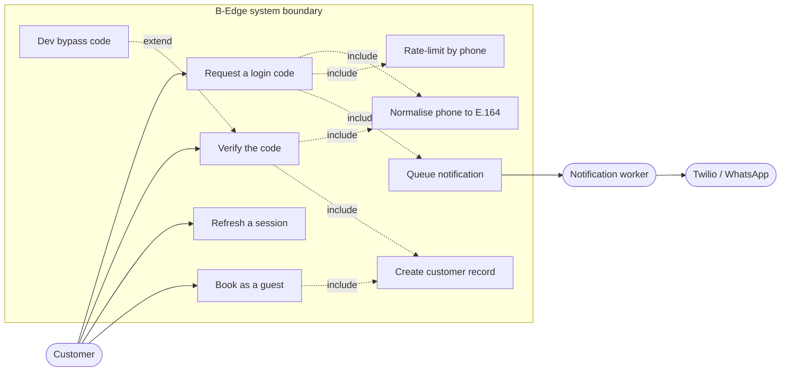
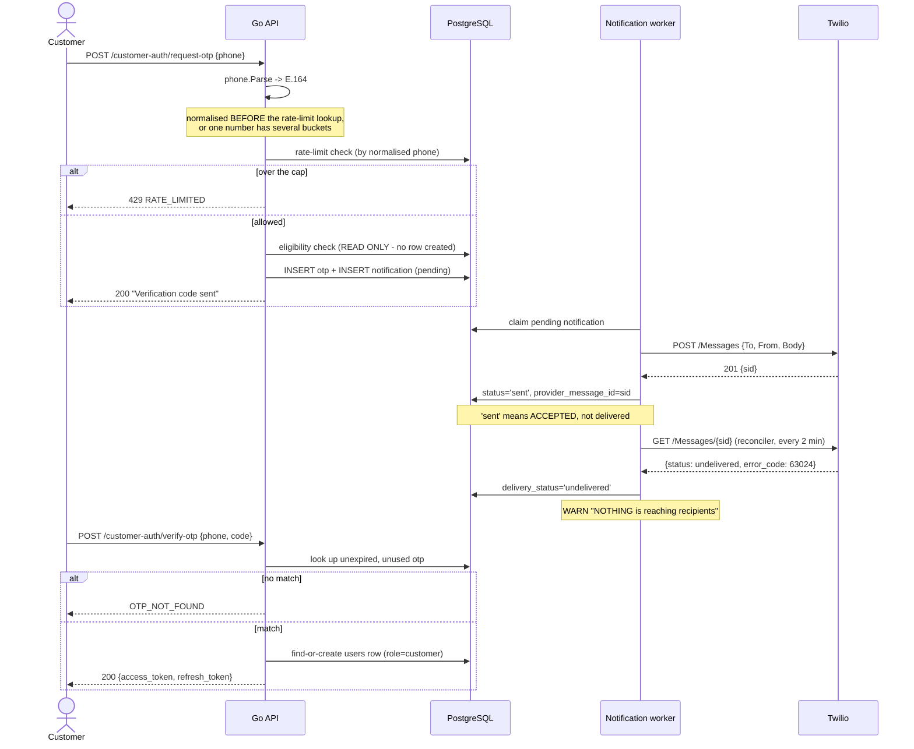
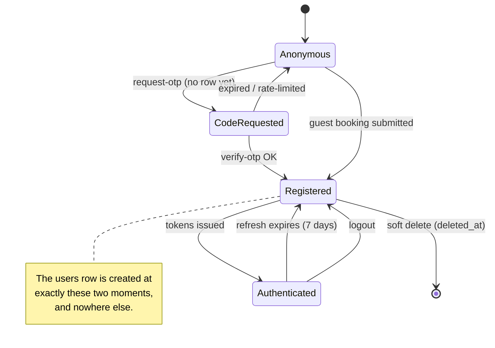

# Workflow 1 · Customer Registration & Profile Onboarding

**Date:** 2026-09-21 · **Status:** verified against the running stack
**Panel:** Software Architect · Systems & Use Case Analyst · UML Specialist

> **Scope correction, up front.** Three of the four workflows in the brief
> assume a marketplace this is not. B-Edge has **no payment gateway**, **no
> payouts**, **no staff/resource model**, and **no separate salon
> registration**. Those are recorded in §6 as *Unimplemented / Unknown in
> Code* rather than documented as if they existed. This file covers
> Workflow 1 only.

---

## 1. Process Specification

### Actors

| | Actor | Role |
|---|---|---|
| Primary | **Guest / Customer** | Owns a phone number; wants to book |
| Secondary | **Twilio (WhatsApp)** | Delivers the one-time code |
| Secondary | **Rate limiter** | Caps requests per phone |
| — | *Admin* | **No role.** Customers are never approved or reviewed |

### Pre-conditions & assumptions

- The customer has a phone number reachable on WhatsApp.
- **No prior account is required.** There is no customer `register`
  endpoint — `POST /auth/register` is artist-only.
- Numbers are normalised to **E.164** before anything else happens.

### Trigger

`POST /api/v1/customer-auth/request-otp` with a phone number — either from
the login screen, or implicitly at the end of the guest booking funnel,
which creates a customer record without any login at all (see §2).

### Happy path

1. Customer submits a phone number.
2. Service **normalises to E.164** (`phone.Parse`, default ISO `LB`).
3. Rate-limit check, keyed on the **normalised** number.
4. Eligibility check — **read-only**.
5. A code is generated and a `notifications` row is queued.
6. The notification worker hands it to Twilio.
7. Customer submits phone + code to `verify-otp`.
8. **The `users` row is created here**, on first successful verification.
9. Access + refresh tokens are issued; refresh lasts **7 days**.

### Alternative flows

| | Flow | Behaviour in code |
|---|---|---|
| A1 | **Guest booking creates the account** | `SubmitGuestBooking` calls `CreateGuestUser` with a normalised phone. A customer can exist having never logged in. |
| A2 | Returning customer | `verify-otp` finds the existing row; no duplicate is created |
| A3 | Development bypass | Code `326321` skips verification entirely — see §5, this is a finding |

### Exception flows

| | Condition | Response |
|---|---|---|
| E1 | Unparseable phone | `422 VALIDATION_ERROR` |
| E2 | Too many requests for one number | `429 RATE_LIMITED` |
| E3 | Wrong or unknown code | `OTP_NOT_FOUND` |
| E4 | Expired / already-used code | `OTP_NOT_FOUND` |
| E5 | Invalid refresh token | `401 TOKEN_INVALID` |
| E6 | **WhatsApp never arrives** | **No error at all.** The API returns success; the code is queued and dies silently. This is the live state — see §5 |

### Post-conditions

- **Success:** a `users` row with role `customer` and an E.164 phone; tokens
  issued.
- **Failure before verify:** *no row is created.* Deliberate — see §5.

---

## 2. Use Case Model



**Note the shape.** `Create customer record` is included by **both**
`Verify the code` and `Book as a guest`. Those are the only two ways a
customer comes into existence, and neither is a registration form.

---

## 3. Formal UML

### 3.1 Sequence — request and verify



### 3.2 State machine — the customer identity



---

## 4. Code vs. Logic Gap Analysis

### Discrepancies

- **There is no customer profile onboarding.** The brief's "Profile
  Onboarding" does not exist: no avatar, no preferences, no profile
  completion step. A customer is a name and a phone number. Not a defect —
  but the workflow named in the brief is *half* implemented, and the missing
  half was never specified.
- **No email anywhere in the customer path.** Identity is the phone number.

### Concurrency

- Two simultaneous `verify-otp` calls for a new number could race on the
  insert. `CreateGuestUser` is a find-or-create; `users.phone` carries a
  **UNIQUE constraint**, so the loser gets a constraint violation rather
  than a duplicate. **Verified indirectly** — `users_phone_unique` fired
  during testing on 2026-09-19. Not load-tested at the auth path.

### Failure & rollback

- **The OTP row and the notification row are written, then Twilio is called
  by a separate worker.** This is correct: no external call sits inside the
  transaction, and a Twilio outage leaves a queued row rather than a
  half-registered customer.
- **The reverse risk is real and live:** the API answers *"Verification code
  sent"* whether or not anything is ever delivered. Since delivery is
  currently **0%**, every customer login attempt ends in a message that
  never arrives and an API that reported success.

### Validation & security

- Phone normalisation happens **before** the rate-limit lookup, so the
  per-number cap cannot be bypassed by reformatting. Correct, and commented
  as such.
- `request-otp` **deliberately creates no user row** — an unauthenticated
  endpoint that created accounts would let anyone pre-register strangers'
  numbers. Fixed in an August 2026 audit; the comment records it.

---

## 5. Findings

### F1 — Development OTP bypass was live on a public URL · **CRITICAL, fixed**

`devBypassOTPCode = "326321"` lets any code-holder authenticate as **any
phone number**, gated on `APP_ENV == "development"`.

The gate is written correctly and fails closed: unset, empty or misspelled
all leave it shut. The failure was not the code — it was that a
**development-mode API was being served over a public tunnel** to the launch
artist.

**Verified exploitable**, against the public customer URL on 2026-09-21:

```
POST /api/v1/customer-auth/verify-otp {"phone":"70999888","code":"326321"}
-> 200, access token issued for a number that never requested a code
```

`APP_ENV` was set to `production` and the same request now returns
`OTP_NOT_FOUND`. The account the test created was deleted.

**This also closed a second exposure:** `EnableStackTrace` is gated on the
same variable, so the public API had been returning Go stack traces on panic.

**Residual risk:** `.env` is gitignored and machine-local. Nothing prevents
the next person running a public tunnel from a development configuration.
The durable fix is that a publicly-reachable deployment should not be reading
a developer's `.env` at all.

### F2 — Success is reported for a message that never arrives · **live**

`request-otp` returns *"Verification code sent"* on queueing. Delivery is
**0% and has always been** (91 notifications, none delivered). The customer
is told to check WhatsApp for a code that does not exist, and there is no
state in which the API tells them otherwise. Blocked on Meta business
verification, not on code.

### F3 — No customer profile onboarding exists · **gap, not defect**

Named in the brief, absent from the code and from any spec.

---

## 6. Unimplemented / Unknown in Code

Flagged rather than assumed, per instruction.

| Brief's workflow | Reality |
|---|---|
| **Salon Registration & Verification** | No such flow. A `salons` row is created inside artist **onboarding** (`onboarding/repository.go:63`). There is no salon-level registration, no verification queue for a business entity, and **no staff model at all** — zero tables matching staff/employee/resource. |
| **MUA banking / payout setup** | Does not exist. The `payout` package is **not payouts** — its own doc comment says it "owns where a salon's money should be sent", i.e. `salon_payment_methods`, the OMT/Whish account a *customer* sends a deposit to. **B-Edge holds no money**: no ledger, no settlement, no commission, no payout table. |
| **Payment gateway (Stripe et al.)** | No integration. Deposits move customer-to-artist out of band. Any diagram showing a payment gateway actor would be fiction. |
| **Cancellation insurance, promo extensions** | Promo codes exist (`internal/promo`); cancellation insurance does not. |

---

## 7. Tri-Expert Panel Verdict

### Systems & Use Case Analyst

Domain model is **complete for what it claims** and narrower than the brief
assumes. The two-path identity creation — verify-otp *or* guest booking — is
unusual and correct for a market where a customer should not need an account
to book. The genuine gap is **E6**: there is no flow, anywhere, for "the code
never arrived", and that is the single most likely thing to happen today.
**Missing edge case:** no resend, no fallback channel, no way for a customer
to report non-delivery.

### UML Specialist

Diagrams above are syntactically valid Mermaid and render. Two notation
compromises, stated rather than hidden: Mermaid has no native UML use-case
notation, so `<<include>>` / `<<extend>>` are expressed as labelled dotted
edges in a `flowchart`, which is the conventional substitute. The state
machine models the **customer identity**, not the session — modelling both in
one diagram would have required a concurrent region that Mermaid cannot
express faithfully.

### Software Architect — reliability **6 / 10**

Sound where it has been thought about; the deductions are for what surrounds
it.

**Strengths.** Normalisation before rate-limiting is a genuine security
detail, not a formality. Declining to create a row on an unauthenticated
endpoint is exactly right and was a deliberate fix. No external call inside
a transaction. Fail-closed environment gating.

**Critical failure points.**
1. *(was)* A universal login bypass reachable from the internet — F1, now
   closed, but it reached that state because nothing ties "publicly
   reachable" to "not development mode".
2. A 100% delivery failure that the API reports as success — F2.
3. `users.phone` UNIQUE is the only thing serialising concurrent
   registration. It holds, but by constraint violation rather than design.

**Recommendations, in order.**
1. Make the environment gate structural, not conventional: refuse to boot
   with `APP_ENV=development` when a public base URL is configured.
2. Give `request-otp` a truthful failure path — surface the reconciler's
   `delivery_status` so the UI can say "we could not reach your WhatsApp".
3. Add an explicit find-or-create on `users.phone` rather than relying on
   the unique index to arbitrate.
